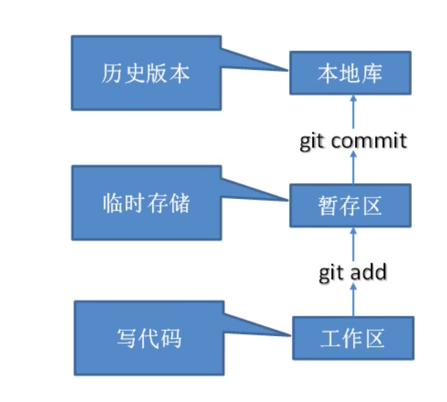
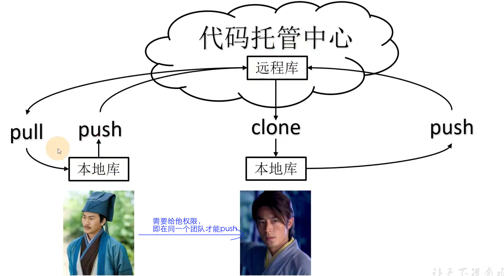
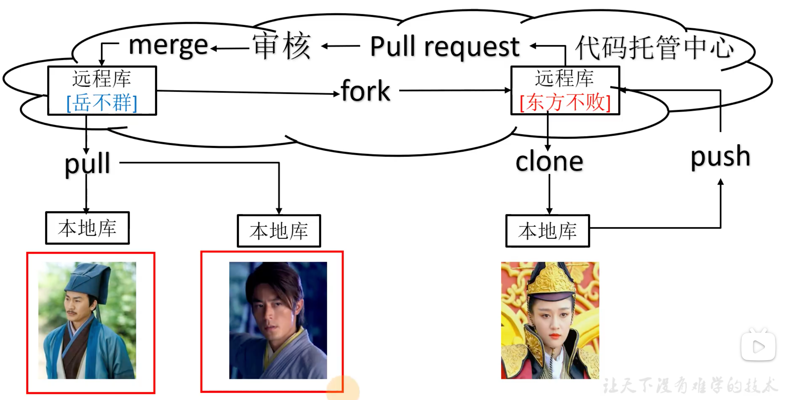

# Git 分布式版本控制

### 简介

版本控制：举例，写论文

分布式版本控制出现之后解决了集中版本控制的缺陷：（每个节点本地都保存所有版本？？？还是历史记录）

1.服务器断网的情况下也可以进行开发（因为版本控制是在本地进行的）

2.每个客户端保存的也是整个项目（包含历史记录，更加安全）

### 工作机制 & 代码托管中心

工作区可以删除没有历史版本记录；暂存区也可以删除，不留下历史版本记录；

但是提交 commit 本地库会留下历史记录

还有代码托管中心，基于网络服务器，即远程库，比如Github，Gitee（互联网）;  GitLab（局域网）;

本地库 ——>远程库 用 push

### 安装

windows 安装 git官网下载最新版本 

安装时选择Vim编辑器；环境变量选git bash中，不修改环境变量；其他默认

### Git的常用命令

| 命令名称                             | 作用                   |
| ------------------------------------ | ---------------------- |
| git config --global user.name 用户名 | 设置用户签名           |
| git config --global user.email 邮箱  | 设置用户签名           |
| **git init**                         | 初始化本地库           |
| **git status**                       | 查看当前本地库状态     |
| **git add 文件名**                   | 追踪更改，添加到暂存区 |
| **git commit -m “日志信息” 文件名**  | 提交更新到本地库       |
| **git reflog**                       | 查看简略历史记录       |
| **git reset --hard 版本号**          | 更改版本号，版本穿梭   |

#### 设置用户签名

前两个命令，安装后只需要设置一次用户签名，如果不设置提交代码是会有错误？                                                                      签名的作用是不同操作这身份，以此确认是谁提交本次的代码。*注意：跟Github的登录账号没有关系*

#### 初始化本地库

##### 语法：git init 

本地库 

### Git 团队协作机制

要用到代码托管中心（远程库，服务器）

##### 1.团队内协作

##### 2.跨团队协作

